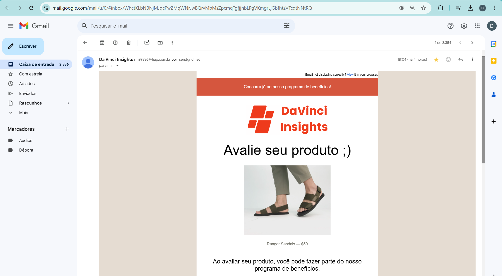
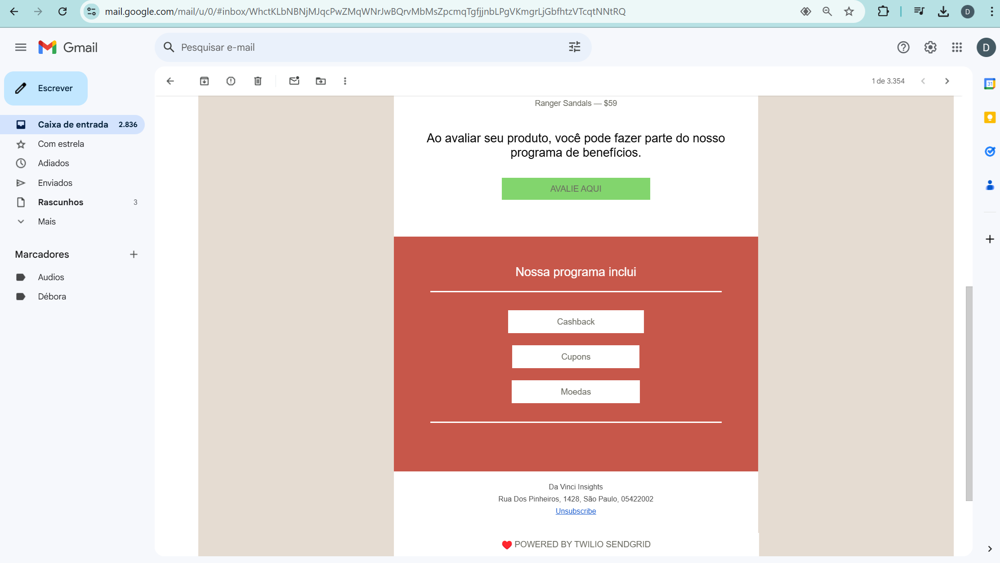
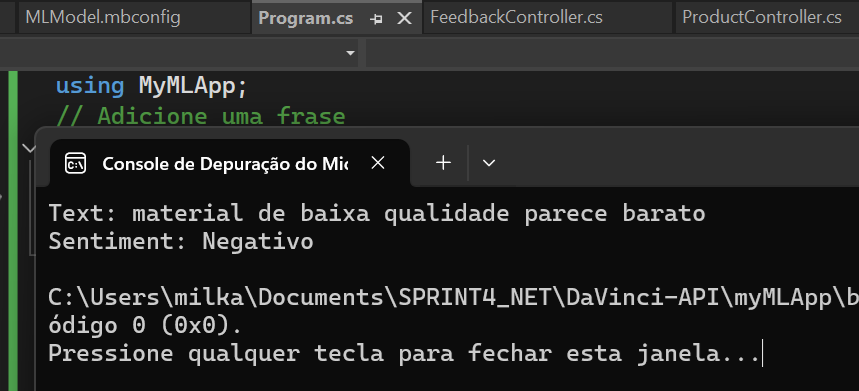
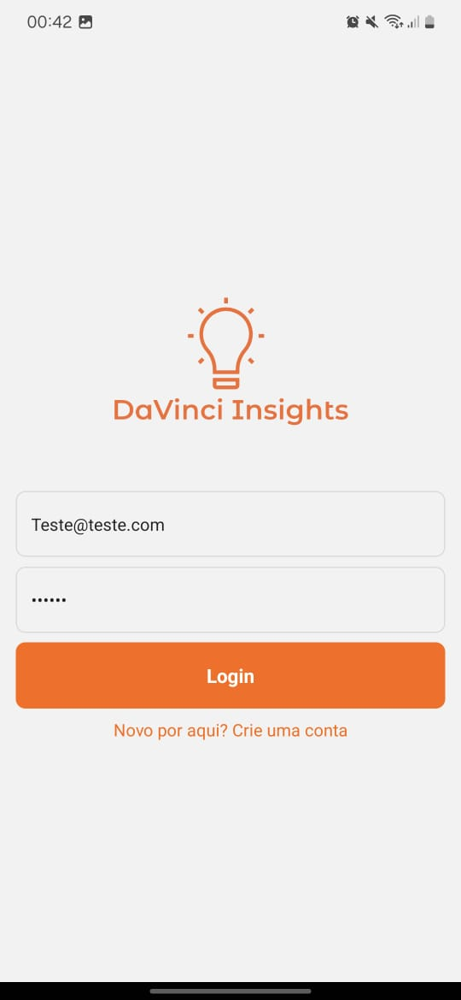
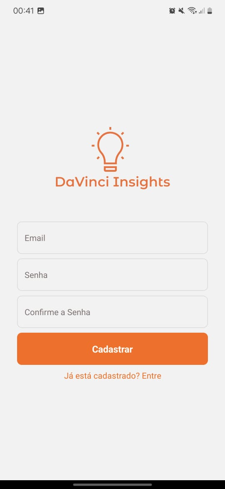
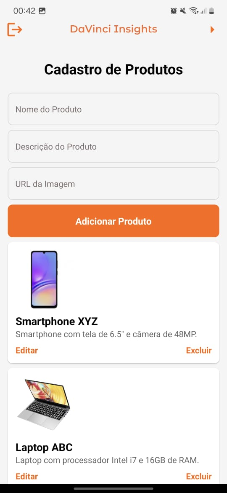
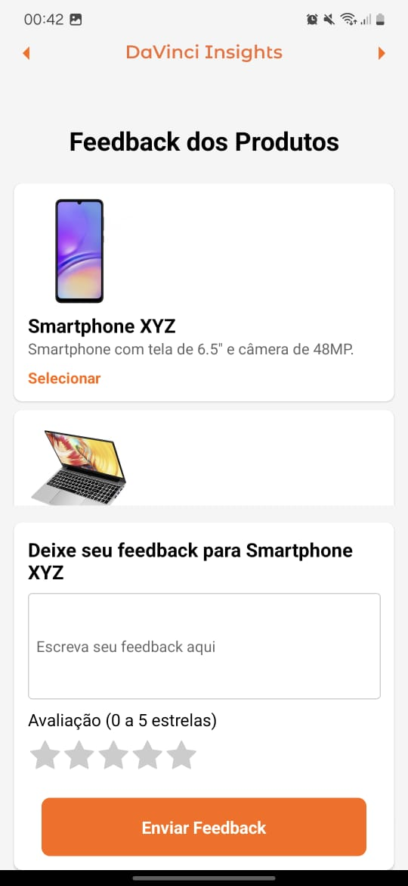
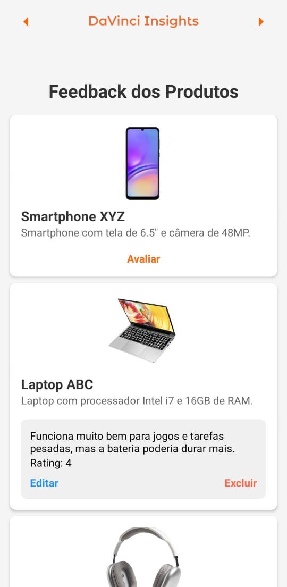
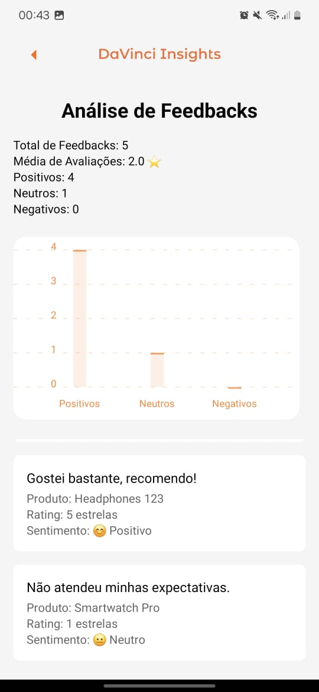

# Documentação Final (Sprint 4): 
# Disruptive Architectures: IOT, IOB & GENERATIVE IA

# 👨‍👨‍👧‍👧 Equipe DaVinci

- RM550341 - Allef Santos (2TDSPV)
- RM97836 - Débora Dâmaso Lopes
- RM551491 - Cassio Yuji Hirassike Sakai
- RM550323 - Paulo Barbosa Neto
- RM552314 - Yasmin Araujo Santos Lopes

#  💡DaVinci Insights

O projeto tem como objetivo processar dados de feedbacks de usuários que adquiriram produtos ou serviços. A análise desses feedbacks visa extrair insights para que as empresas possam entender as razões das avaliações (sejam elas positivas ou negativas), definir estratégias para melhorar a satisfação dos consumidores e conquistar novos compradores. As avaliações dos clientes são cruciais para a decisão de compra de novos clientes.

## 🎯 IOT: Objetivo Principal da Sprint 4

Apresentar a versão final do projeto desenvolvido, juntamente com uma autocrítica que reflita as experiências, aprendizados e desafios enfrentados ao longo do processo (em conclusão).

## ✍️ Objetivos Específicos

- Demonstração da Versão Final do Projeto:

Demonstrar as funcionalidades implementadas, tanto no backend em .NET quanto no aplicativo mobile em React Native.
Apresentar as principais features como o CRUD completo, envio de e-mails para feedbacks ausentes, análise de sentimentos usando ML.NET, autenticação de usuários, registro de compras, e visualização de feedbacks.

## 🚀 Funcionalidades Gerais

- Envio de e-mails solicitando feedback (backend com serviço Sendgrid)
- Análise de sentimento associado ao feedback (mobile e backend)
- Visualização de feedbacks intuitiva (mobile)
- Lembrete de feedback (mobile)

## 🖥️ API em .NET

No projeto backend desenvolvido em .NET, implementamos uma série de funcionalidades essenciais na API, garantindo a integração com IA utilizando ferramentas do ML.NET e mantendo um sistema de gerenciamento de recursos. Realiza CRUD completo para as entidades como 
*Clientes (Costumer)* (permite a gestão eficiente da base de consumidores), *Produtos (Product)* (possibilita o gerenciamento do catálogo de itens), *Feedbacks (Feedback)* (permite que os clientes forneçam avaliações sobre os produtos adquiridos) e *Compras (Purchase)* (registros de compra e a vinculação entre clientes e produtos) e foi documentado com swagger.

📧 **Integração com Serviço Externo para Envio de E-mails:** 

Integramos a SendGrid como provedora de envio de e-mails para enviar lembretes de feedback aos clientes que realizaram compras, mas não forneceram avaliação. O FeedbackReminderService.cs é responsável por gerenciar essa funcionalidade, buscando no banco de dados as compras que ainda não têm feedback associado e enviando um e-mail automático lembrando o cliente da importância de sua opinião.

😄 **Análise de Sentimentos com ML.NET:**

Integramos um modelo de análise de sentimentos utilizando o ML.NET para processar os feedbacks dos clientes. O objetivo foi classificar os comentários como "positivos" ou "negativos", auxiliando o time da loja a entender a percepção dos consumidores.
Essa análise é utilizada durante o registro dos feedbacks, classificando automaticamente o sentimento de cada comentário enviado pelos clientes.

  

🏛️ **Arquitetura e Design Patterns:**

O projeto utiliza Injeção de Dependência para todos os serviços e repositórios, seguindo boas práticas de arquitetura e facilitando o processo de testes.
Foi implementado o Singleton Pattern para o gerenciador de configuração, garantindo que exista apenas uma instância para a gestão das configurações da aplicação.

📝 **Testes Automatizados com xUnit:**

Implementamos testes unitários para garantir que os métodos críticos de cada controlador (ex.: CostumerController, ProductController) funcionem como esperado.
Testes de integração foram implementados para verificar a integração entre os repositórios e o banco de dados MongoDB, como em ProductRepository e PurchaseRepository.
Testes de sistema focaram na verificação do fluxo completo da aplicação, incluindo o envio de lembretes de feedback por e-mail.
## 📲 Projeto Mobile (Aplicativo)

No projeto mobile, desenvolvido utilizando React Native, implementamos funcionalidades que permitem uma interação intuitiva e eficiente dos consumidores com a loja:

👤 **Autenticação de Usuários:**

Utilizamos o Firebase Authentication para implementar a funcionalidade de autenticação dos usuários, permitindo que clientes façam login e criem contas de maneira segura e fácil.

Exemplos de tela:

  
  

📝 **Cadastro e Gerenciamento de Produtos:**

Criamos telas que permitem que os administradores cadastrem e gerenciem os produtos disponíveis na loja. Os produtos registrados são exibidos no aplicativo, possibilitando a visualização do catálogo.

  

🛒 **Registro de Compras e Feedback:**

Cada compra é registrada através dos endpoints.
Após a compra, o aplicativo também permite que o cliente forneça feedbacks sobre os produtos adquiridos. Esses feedbacks são registrados e submetidos à análise de sentimento utilizando IA.

  
  

📊 **Visualização de Feedbacks e Insights:**

Desenvolvemos telas para a visualização dos feedbacks dos produtos, incluindo insights sobre a opinião dos clientes. A classificação dos sentimentos (positivo/negativo) é exibida de forma destacada, permitindo que os consumidores tenham uma ideia da experiência de outros compradores.
Esses insights são exibidos de forma que facilite a tomada de decisão, tanto por parte dos clientes (na escolha de produtos) quanto pelos administradores (para melhorar seus produtos e serviços).

  

📆 **Fluxo de Lembrete de Feedback:**

A aplicação também colabora no envio de lembretes de feedback. 

## 💡Autocrítica sobre o Processo de Desenvolvimento

Refletir sobre o que funcionou bem e o que trouxe mais dificuldades durante o desenvolvimento.

**✅ O que funcionou:**

Backend Robusto: O uso do .NET como backend mostrou-se eficaz para fornecer uma infraestrutura robusta, garantindo a implementação de funcionalidades importantes como análise de sentimento e envio de e-mail, análise de sentimento e documentação via Swagger se destacaram por trazerem valor ao produto.

Experiência do Usuário: O aplicativo mobile foi desenvolvido com foco na experiência do usuário, proporcionando uma navegação simples, com autenticação segura e um fluxo fácil para registrar feedbacks e realizar compras.

**❎ O que não funcionou:**

Alguns desafios enfrentados incluíram dificuldades na implementação inicial modelo em .NET: num primeiro momento, ao tentar integrar o modelo treinado na Sprint 3 (entrega passada), foi realizado a conversão do modelo anterior para o formato **.onnx**, porém, ainda sim, com dificuldades de integra-lo ao .NET. 

Como solução alternativa, foi usado a ferramenta de ML.NET dentro do próprio Visual Studio para treinar outro modelo seguindo as instruções da documentação do ML.NET. Ao treinar o modelo com o dataset fornecido pela própria ML.NET (amazon_cells_labelled.txt) foi identificado uma acurácia de apenas 64%. Para resolver o problema da acurácia, foi criado outro dataset no formato .csv com dados simulados de feedbacks e labels (0,1) e já normalizados e tratados textualmente prontos para o treinamento, e assim, posteriormente foi treinado no ML.NET com 100% acuracia. 

Ajustes no envio de emails também tomaram mais tempo do que o esperado devido a questões iniciais de configuração do serviço e email encaminhado para SPAM. Por enquanto temos apenas a configuração para enviar emails para os feedback ausente realizada. Posteriormente será adicionado outros tipos de email, como por exemplo, emails de boas vindas e de envio de cupons e cashbacks. Vale ressaltar que ainda temos que desenvolver o sistema de envio de cupons e recompensas para os feedbacks ausentes, por hora o email solicita a avaliação do produto ao cliente mas ainda não é capaz de enviar cupons.

**📚 O que foi aprendido:**

Aprendemos bastante sobre integração de serviços externos, e como configura-los. Aprendemos a importância de padrões de projeto para a manutenção e qualidade do código de maneira mais rápida e intuitiva. 

**✍️ O que fariam diferente:**

- Mudança na arquitetura backend:
Em uma próxima versão, para escalonar o projeto em .NET em maior escala, consideraríamos trocar a arquitetura monolítica (mais recomendada para testes) para uma arquitetura de microserviços.

Consideramos também alguns planos futuros de novas funcionalidades para o projeto, caso necessário: 

- Expandir e adicionar novas funcionalidades de IA, como recomendações personalizadas de produtos com base no histórico de compras dos clientes.

- Tornar o aplicativo ainda mais interativo, adicionando uma seção de ofertas especiais e permitindo que os clientes personalizem suas preferências.

- Introduzir um sistema de recompensas para incentivar os clientes a deixarem feedback, oferecendo pontos de fidelidade que poderiam ser trocados por descontos.

## 📽️ Video Pitch

 [📹 YouTube](https://youtube.com/playlist?list=PL1zapSlcAQTdAyAUScqkEolyq5jqjomnd&si=4Yg6hqlYDXdXGVG3)
